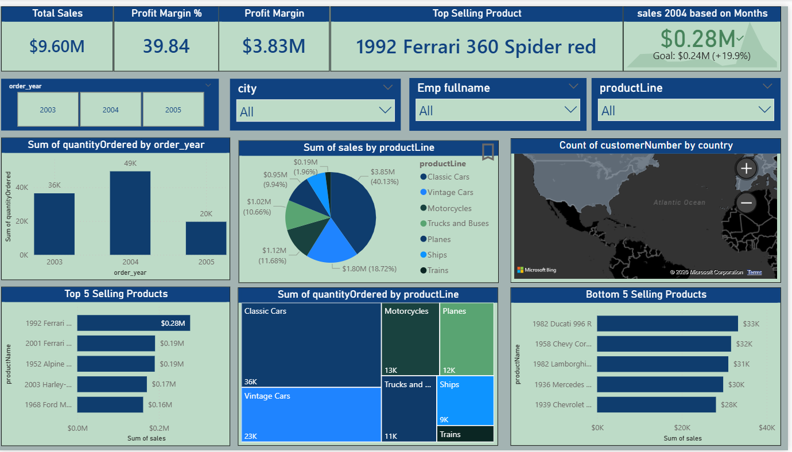
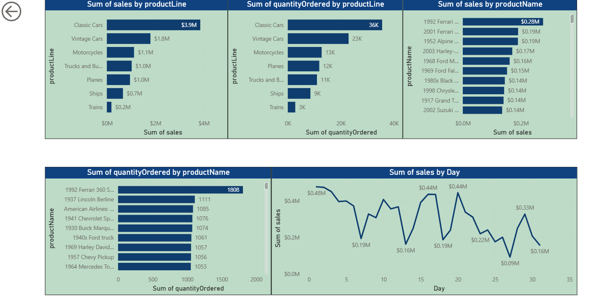
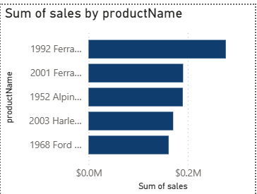

# Sales Dashboard using Power BI

This project is a sales analysis dashboard created in Power BI using the Classic Models dataset.

The dashboard helps analyze:
- overall sales performance
- profit margins
- product line performance
- customer distribution by country
- top and bottom selling products

I created this project to practice data visualization, dashboard design, DAX measures, and interactive reporting in Power BI.

## Tools Used
- Power BI
- DAX
- CSV Files

## Dashboard Features
- KPI cards for sales and profit analysis
- Year and product-based filtering
- Product line sales breakdown
- Country-wise customer analysis using maps
- Top 5 and Bottom 5 selling products
- Quantity ordered analysis
- Interactive visuals and tooltip page

## Dashboard Screenshots

### Main Dashboard

### Analysis Page

### Interaction / Tooltip Demo

## Dataset Tables Used
- customers
- employees
- offices
- orders
- order details
- payments
- products
- productlines

## Files Included
- Power BI dashboard file (.pbix)
- Dataset CSV files
- Dashboard screenshots

## Learning Outcome
Through this project, I improved my understanding of:
- data modeling
- DAX calculations
- dashboard designing
- slicers and filters
- data storytelling in Power BI

## Author
Amulya
